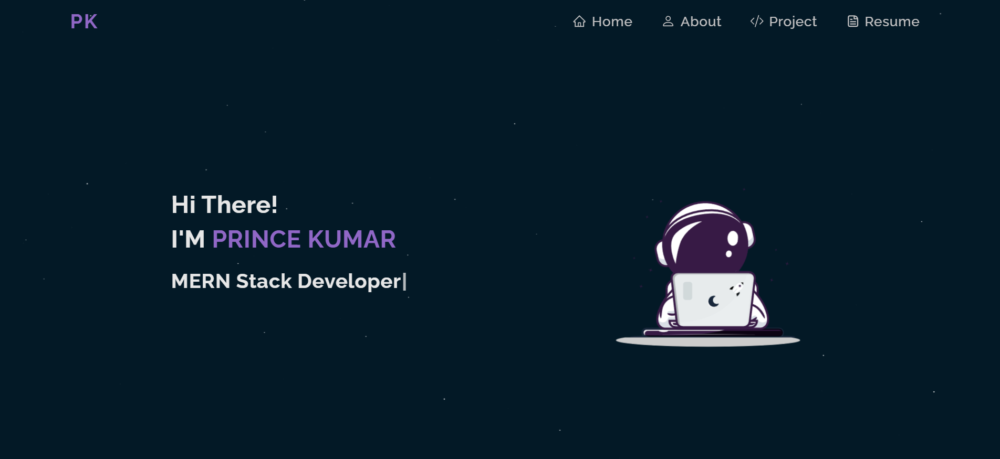

<h2 align="center">Personal Portfolio   <a target="_blank" href="https://princeportfolios.netlify.app/">Prince Kumar</a></h2>

 

## About 

This project is my personal portfolio which features some of my skills, GitHub projects and my resume.

These technologies are used to build this website:

<ul>
  <li>React.js</li>
  <li>Git</li>
  <li>npm packages</li>
  
</ul>

Some of the features of this website are:

<ul>
  <li>Multi-page layout</li>
  <li>Fully responsive</li>
  <li>Preloader</li>
  <li>Refresh on clicking logo</li>
</ul>

npm packages used:

<ul>
  <li><a target="_blank" href="https://www.npmjs.com/package/lottie-react">lottie-react</a>: For the animations used in the website.</li>
  <li><a href="https://www.npmjs.com/package/react-spinners">react-spinners</a>: For the preloader animation.</li>
  <li><a href="https://www.npmjs.com/package/react-icons">react-icons</a>: For all the icons.</li>
  <li><a href="https://www.npmjs.com/package/typewriter-effect">typewriter-effect</a>: The typing effect on the home page.</li>
  <li><a href="https://www.npmjs.com/package/react-pdf">react-pdf</a>: To preview the resume pdf</li>
  <li><a href="https://www.npmjs.com/package/react-parallax-tilt">react-parallax-tilt</a>: To apply tilt hover effect on react components like image and animation.</li>
</ul>

## Support

Show your support by leaving a star ⭐ on this repo, if you like the website.

Fell free to point out any bugs🪲 or improvements in the issues tab.

